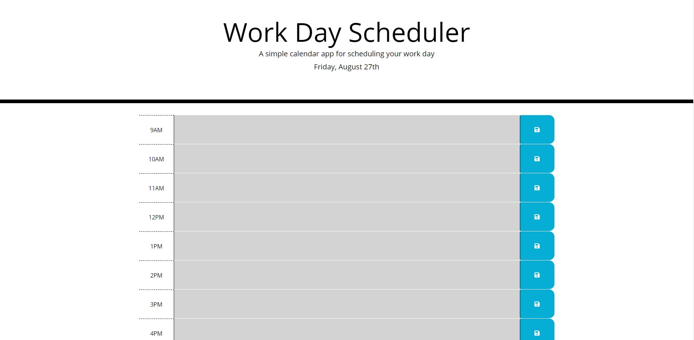

# Day Planner

Day Planner is a simple calendar application that allows the user to save events for each hour of the day.  The app runs in the browser and has dynamically updated HTML and CSS powered by jQuery.  Our app is limited to standard business hours, so the user can enter events between 9 am and 5 pm for each hour.

## Links

* Deployed App: https://8ilalo.github.io/day_planner_homework/
* Github Repo: https://github.com/8ilalo/day_planner_homework

## Screenshot

